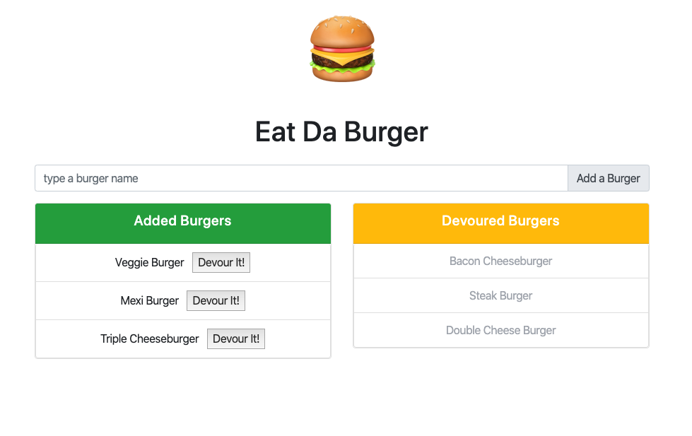

# Eat Da Burger / [Demo](https://aqueous-beyond-86348.herokuapp.com/) 


## Description

Eat Da Burger is a full stack web application that lets you add a burger and then devour it. It's just a prototype web app to showcase a basic [CRUD](https://en.wikipedia.org/wiki/Create,_read,_update_and_delete) app. At the moment this app is just a CRU app.

This app was built using the [MVC](https://en.wikipedia.org/wiki/Model%E2%80%93view%E2%80%93controller) framework where an ORM file was used to make general purpose SQL queries that can later be reused and views folders for dynamic rendering of HTML.

## Technologies

For the backend, this app was built with [Node.js](https://nodejs.org/en/), [Express](https://expressjs.com/), and [MySQL](https://www.mysql.com/). On the frontend it's using the templating engine [Handlebars](http://handlebarsjs.com/), I grabbed [Bootsrap](https://getbootstrap.com/) to pull in some components and do a simple layout, and finally it's grabbing the $.ajax method from [jQuery](https://jquery.com/). 

## Usage and Installation

Feel free to clone or fork this repo if you find it useful. To install dependencies make sure to run:

```
npm i
```

You will also need to install [MySql Workbench](https://www.mysql.com/products/workbench/) or some other application that handles SQL databases. Before spinning up the server, use the files in the db folder, the schema.sql and seeds.sql, end run them in MySql Workbench to have some data and make sure to put in your own user and password in the config/connection.js file.

If everything is ok you should be able to see this app running locally in your browser at localhost:8080. 

## Demo

If you wish to see a working demo of this app you can go [here](https://aqueous-beyond-86348.herokuapp.com/). This app was deployed to [Heroku](https://signup.heroku.com/t/platform?c=70130000001xDpdAAE&gclid=CjwKCAjwvZv0BRA8EiwAD9T2VfFzqqBwiyVnZAGCaHF8oipVBQnMPWDBzwYJTSe7q7LWqNsVzyGBmBoCx7IQAvD_BwE).

## Contributing

If you wish to contribute to this project please do a pull request. That be super cool.

## Questions?


Have any questions? Want to collaborate on a project? Shoot me an [email](yarocruz@gmail.com)
